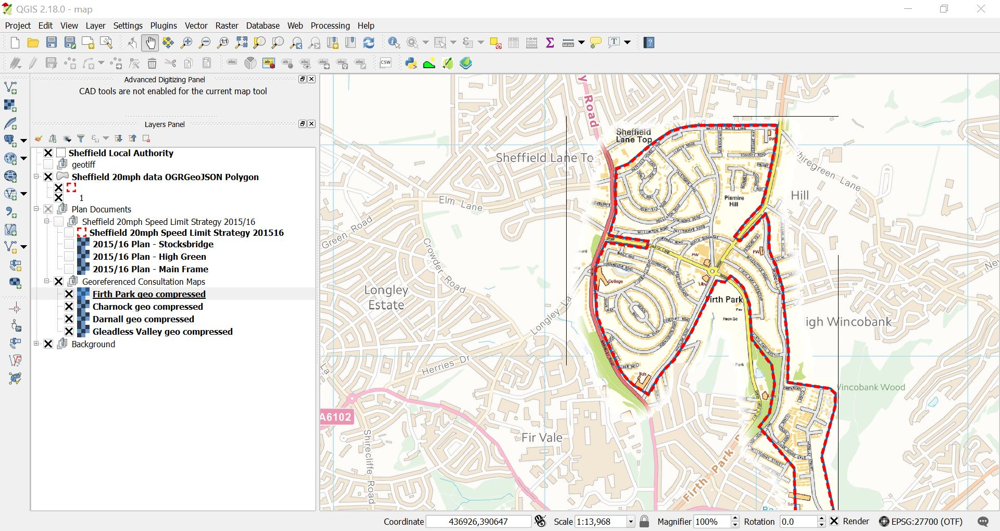

Readme: Digitised 20mph maps of Sheffield
==============

Start here: A QGIS map with all the layers organised and displayed ["/qgis map/map.qgs"](/qgis map/map.qgs)
 
Digitised data available in geojson files (but preview does not work on GitHub, unsupported projection):
 - ["Sheffield 20mph data.geojson"] (Sheffield 20mph data.geojson)
 - ["CouncilMaps\Sheffield 20mph Speed Limit Strategy 201516\Sheffield 20mph Speed Limit Strategy 201516.geojson"] (CouncilMaps\Sheffield 20mph Speed Limit Strategy 201516\Sheffield 20mph Speed Limit Strategy 201516.geojson)

**How it's organised**

The folder 'Council Maps' contains 20mph consultation maps from https://www.sheffield.gov.uk/roads/works/schemes/new-20-mph-speed-limits.html
These have been converted to tiff format and georeferenced (the QGIS map has them shown).

OS VectorMap District - SK Backdrop contains Ordinance Survey background mapping - available to download from https://www.ordnancesurvey.co.uk/business-and-government/products/vectormap-district.html

